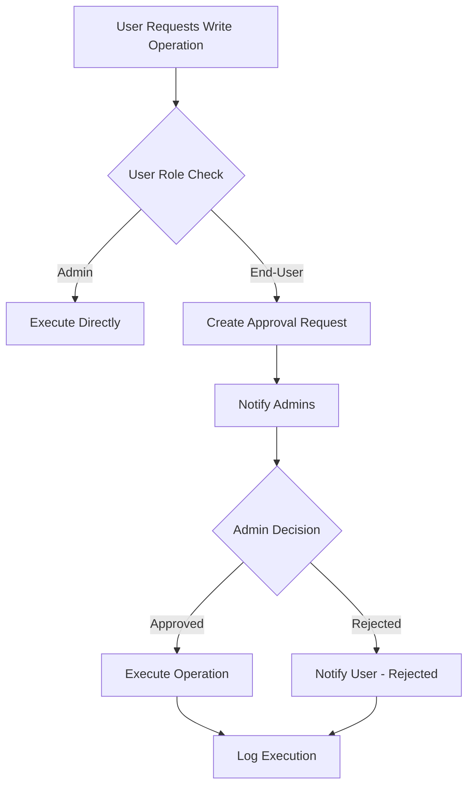
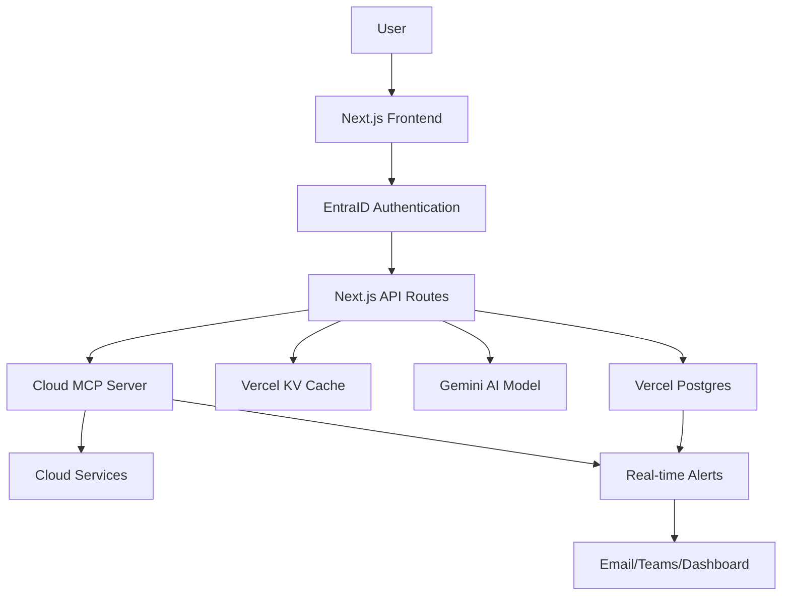

# AI-Powered Chatbot Platform - Product Requirements Document

## Executive Summary
An AI-powered chatbot application that enables organizational users to manage Cloud infrastructure through natural language interactions. The system integrates with EntraID for authentication, provides role-based access control, and maintains comprehensive audit trails for all Cloud Infrastructure operations.

## Core Objectives
- Enable natural language cloud infrastructure management
- Provide secure, role-based access with approval workflows
- Maintain comprehensive audit trails and real-time monitoring
- Minimize API costs through intelligent rate limiting

## Features & Use Cases

### UC01-01: User Interface, Authentication & User Management

#### Chat Interface
- **Primary Interface**: Clean, responsive chat UI similar to ChatGPT/Claude
- **Message History**: Persistent chat history per user session
- **Real-time Responses**: Streaming responses for better user experience
- **Rich Formatting**: Support for code blocks, tables, and formatted output for our cloud infrastructure

#### Suggested Prompts Panel
- **Role-based Prompts**: Different prompt suggestions based on user role
- **Common Operations**: 
  - "Show me all running compute instances in the [cloud-region]"
  - "List all storage buckets and their sizes"
  - "Check database instances status and costs"
  - "Show serverless functions with high error rates"
- **Quick Actions**: One-click buttons for frequent operations
- **Prompt Categories**: Infrastructure, Billing, Security, Monitoring

#### Side Panel Features
- **Quick Actions**: Bookmarked frequently used commands. There will be some default actions. Users can also bookmark.
- **User Activity History**: Recent commands and operations
- **Real-time Alerts Dashboard**: 
  - **For End-Users**: Personal activity alerts, system status, rate limit status
  - **For Admins**: All system alerts, critical operations, security events, cost alerts
- **System Status**: Real-time system health and cloud service status
- **Cost Dashboard**: Daily/monthly spend tracking for AI and cloud.

#### EntraID Integration (OIDC)
- **Single Sign-On**: Seamless EntraID authentication
- **Group-based Access**: Map EntraID groups to application roles
- **Session Management**: 8-hour session timeout with refresh tokens
- **Multi-factor Authentication**: Inherit MFA requirements from EntraID

#### User Roles & Permissions
```
Admin Role:
- Full read/write access
- User management capabilities
- System configuration access
- Audit log access
- Real-time alert management

End-User Role:
- Read-only access by default
- Request-based write operation approval
- Personal chat history access
```

#### User Database Schema (Vercel Postgres)
```sql
-- Users table
users (
  id UUID PRIMARY KEY,
  entra_id VARCHAR(255) UNIQUE,
  email VARCHAR(255),
  display_name VARCHAR(255),
  role VARCHAR(50), -- 'admin' | 'end-user'
  created_at TIMESTAMP,
  last_login TIMESTAMP,
  is_active BOOLEAN DEFAULT true
)

-- User sessions (stored in Vercel KV for performance)
-- Rate limiting (stored in Vercel KV for real-time tracking)
```


### UC01-02: Approval Workflow System

#### Write Operation Approval


#### Approval Database Schema
```sql
-- Approval requests
approval_requests (
  id UUID PRIMARY KEY,
  requester_id UUID REFERENCES users(id),
  cloud_command TEXT,
  justification TEXT,
  status VARCHAR(50), -- 'pending' | 'approved' | 'rejected'
  approver_id UUID REFERENCES users(id),
  requested_at TIMESTAMP,
  responded_at TIMESTAMP,
  expires_at TIMESTAMP DEFAULT (requested_at + INTERVAL '24 hours')
)
```


### UC01-03: Comprehensive Audit & Monitoring

#### Audit Logging Schema
```sql
-- Activity logs
activity_logs (
  id UUID PRIMARY KEY,
  user_id UUID REFERENCES users(id),
  session_id UUID,
  action_type VARCHAR(100), -- 'command_execution' | 'login' | 'approval_request'
  resource_service VARCHAR(50),
  command_executed TEXT,
  command_response TEXT,
  status VARCHAR(50), -- 'success' | 'error' | 'denied'
  ip_address INET,
  user_agent TEXT,
  timestamp TIMESTAMP,
  duration_ms INTEGER
)

-- Resource changes
resource_change_logs (
  id UUID PRIMARY KEY,
  user_id UUID REFERENCES users(id),
  resource_type VARCHAR(100),
  resource_id VARCHAR(255),
  action VARCHAR(50), -- 'create' | 'modify' | 'delete'
  before_state JSONB,
  after_state JSONB,
  timestamp TIMESTAMP
)
```

#### Real-time Alert System
```yaml
Alert Triggers:
  Critical Operations (Admin Email + Teams):
    - Compute instance termination
    - Storage bucket deletion
    - Database instance deletion
    - Network security policy modifications
    - Multiple failed login attempts
    - Commands executed outside business hours

  Security Events (Admin Email + Dashboard):
    - Unusual access patterns
    - Permission escalation attempts
    - Suspicious command sequences
    
  Cost Alerts (All Users Dashboard + Admin Email):
    - Daily spend exceeds threshold
    - User approaching rate limits
    - Unusual resource creation patterns

  System Events (Dashboard Only):
    - Cloud API errors
    - System performance issues
    - Approval workflow status updates

Alert Distribution:
  Admins Receive:
    - Dashboard alerts (all types)
    - Email alerts (critical + security + cost)
    - Teams notifications (critical operations)
  
  End-Users Receive:
    - Dashboard alerts only (personal activity + system status)
    - No email or Teams notifications
```

### UC01-04: AI Model Integration & Recommendation on Large language models

# Recommended Large Language Models (LLM's)

| Model | Offered by (company) | Best At (practical strengths) | Pricing (per 1M tokens) | Context window |
|---|---:|---|---:|---:|
| **GPT-5 (text & vision)** | OpenAI | Top choice for **agentic workflows & coding** — strong multi-step reasoning, function calling, and developer tooling. Good for high-accuracy, mission-critical actions. | **Input:** $1.25 · **Output:** $10.00 (vendor tiers/variants may vary) | **400K context;** up to **128K max output** tokens |
| **GPT-4o / GPT-4 Turbo (family)** | OpenAI | Production-mature general reasoning & function-calling; excellent ecosystem & third-party tooling (useful as a fallback/high-accuracy brain). | **GPT-4o:** ~$5.00 / $20.00; **GPT-4o-mini:** ~$0.60 / $2.40 (variant-specific). | **128K** (for many Turbo/O variants; mini variants vary) |
| **Claude Sonnet 4** | Anthropic | **Long-context agentic reasoning** with strong safety focus — good for multi-step incident diagnosis and safe action suggestions. | **Input:** $3  · **Output:** $15 | **200K context (standard)**; Sonnet 4 has **1M-token**|
| **Claude Opus 4.1** | Anthropic | Highest-depth **reasoning & coding** in the Claude family (best for deep debugging, long post-mortems). Strong alignment tooling. | **Input:** $15 · **Output:** $75 (Opus tier) | **1M Token**|
| **Gemini 2.5 Flash** | Google (Vertex / Gemini API) | **Cost-efficient long-context** model for chatops and real-time flows — good for high QPS and budget-sensitive workloads. Native grounding (search) and tools. | **Input:** ~$0.30 · **Output:** ~$2.50 (paid tier; see Google pricing for thresholds) | **1,000K (1M) tokens** |
| **Gemini 2.5 Pro** | Google (Vertex / Gemini API) | High-accuracy **reasoning and coding**, good for enterprise agent tasks where you want stronger reasoning than Flash. Supports grounding & tools. | **Input:** ~$1.25 (≤threshold) · **Output:** ~$10.00 (≤threshold); higher rates above thresholds | **1M** (2M availability on select Pro tiers) |
| **Grok 4** | xAI (Grok / x.ai) | Grok 4 excels at **deep reasoning and understanding complex data** | **Input:** $3  · **Output:** $15 | **256K context**;|

# AWS Bedrock Service

**What is AWS Bedrock** : Amazon Bedrock is a fully managed service that offers a choice of high-performing foundation models (FMs) through a single API, along with a broad set of capabilities you need to build generative AI applications with security, privacy, and responsible AI.

**Model catalog provides AI models from leading providers** (list from AWS console): Al21 Labs, Amazon, Anthropic, Arcee Al, Autogluon, BRIA AI, Camb.ai, Cohere, DeepSeek, EvolutionaryScale, PBC, Gretel, HuggingFace, IBM Data and Al, Inception JetBrains s.r.o, John Snow Labs,Karakuri, LG CNS, LG U+, Liquid Al, Meta, Mistral, Mistral, Al, NCSoft, NVIDIA, Preferred Networks, Protopiaaiinc, Stability Al, Stockmark Inc, TwelveLabs, Upstage, Voyage Al, Widn.Al, Writer

**Pricing model for Bedrock** (As per the documentation) : With Amazon Bedrock, you pay to run inference on foundation models. Pricing is based on the volume of input tokens and output tokens, and
on whether you have purchased Provisioned Throughput for the model. 

**Limitation with Bedrock** : Models from popular vendors such as Google, OpenAI (except open source models) & xAI are not hosted on this service, although latest models from Anthropic are available

## Technical Architecture

### Application Stack
```yaml
Frontend:
  Framework: Next.js 14 with App Router
  Styling: Tailwind CSS
  State Management: Zustand
  Real-time: WebSocket connections
  
Backend:
  Runtime: Node.js 20
  Framework: Next.js API routes
  Database: Vercel Postgres
  Cache: Vercel KV (for sessions and rate limiting)
  
Authentication:
  Provider: EntraID (Azure AD)
  Protocol: OpenID Connect
  Session: JWT with refresh tokens stored in Vercel KV
  
AI Integration:
  Model: Google Gemini 2.5 Pro
  API: Google AI Studio / Vertex AI
  Rate Limiting: Custom middleware with Vercel KV
  
```

### Infrastructure Requirements
```yaml
Hosting:
  Platform: Vercel Pro
  Region: Must support deployment in multiple geographic regions (e.g., us-east-1)
  CDN: Vercel Edge Network
  
Database:
  Service: Vercel Postgres
  Tier: Pro plan
  Backup: Automatic daily backups (Vercel managed)
  
Cache & Sessions:
  Service: Vercel KV (Redis)
  Usage: Rate limiting, session storage, real-time data
  
Monitoring:
  Application: Vercel Analytics & Insights
  Database: Vercel Postgres Insights
  Logs: Vercel Function Logs + structured logging
  
Communication:
  Email: SMTP service (SendGrid/AWS SES)
  Teams: Microsoft Teams webhooks
  Dashboard: Real-time WebSocket connections
  
Security:
  SSL/TLS: Automatic (Vercel)
  Secrets: Vercel Environment Variables
  API Keys: Secure key rotation
```

### Data Flow Architecture



### Security Guardrails
```yaml
Command Validation:
  - Syntax validation before execution
  - Dangerous command detection
  - Resource impact assessment
  - Cost estimation for operations

Input Sanitization:
  - SQL injection prevention
  - Command injection protection
  - XSS prevention in chat interface
  
Output Security:
  - Sensitive data masking
  - Credential scrubbing
  - PII detection and removal
```


